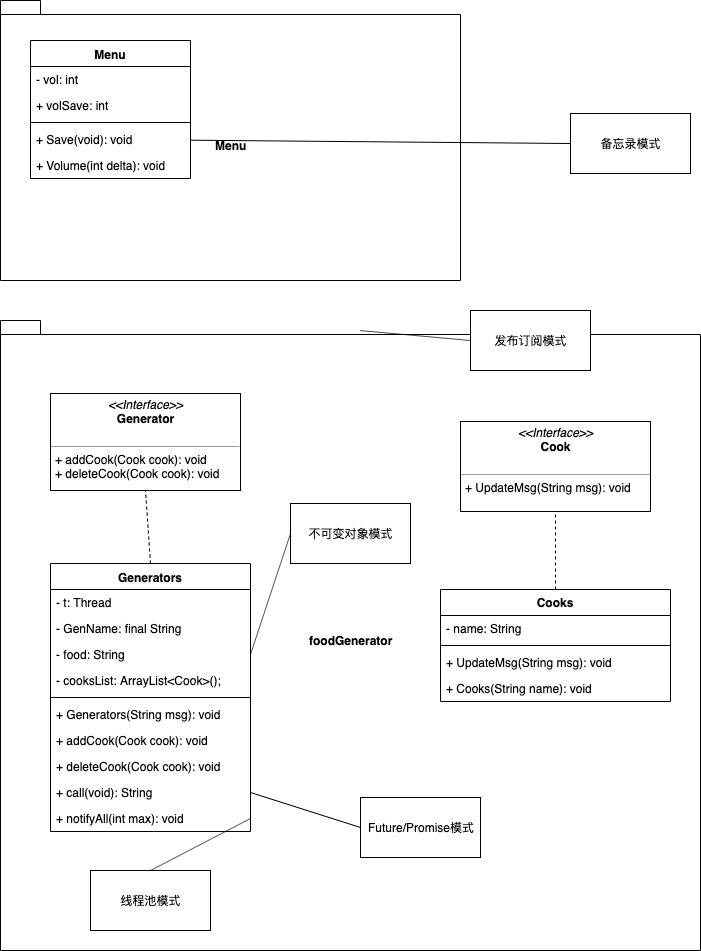

# DOC

## 设计模式

### memento

Memento即备忘录模式，常用于保存一个对象的一种属性的状态。在undercook中，实现备忘录模式的class为menu，保存了menu的音量的信息。

API：

```java
public static void Save() {
    System.out.println("Save data");
    volSave = vol;
}
```

运行Save()函数后，将音量保存至一个volSave静态变量中，完成对音量的保存，实现备忘录模式。

### immutable

在多线程编程中，不可变对象模式是保证**不用加锁实现线程安全**。具体的方法便是，在声明变量的时候使用`final`关键字，

```java
private final String GenName; // 不可变对象模式
```

并且不定义setter函数，仅在构造函数时定义GenName的值。GenName为食材工厂生产的食材的名字，一经初始化就不能且不应该改变。

### publish subscriber

发布订阅模式。其中，Generators是发布者，而Cooks为订阅者，Generators生产食材，并发布告知所有Cooks该食材生产好了。

Generators维护一个list存放所有订阅者

```java
private List<Cook> cooksList = new ArrayList<Cook>(); // 订阅者
```

且提供两个API：

```java 
public void addCook(Cook cook) {
    cooksList.add(cook);
}
```

```java
public void deleteCook(Cook cook) {
    cooksList.remove(cook);
}
```

用于添加与删除订阅者。

必要时，发布生产食材的信息给所有的订阅者。

```java
for (Cook list : cooksList) {
    list.UpdateMsg(this.GenName);
    Thread.sleep(50);
}
```

调用所有订阅者的函数UpdateMsg()。

### future/promise

多线程的实现方式有很多种，大多数的多线程设计模式都不能够返回返回值，（如上述的依靠实现run()而完成的多线程），但是future/promise模式可以。

Java中实现future/promise模式可以靠实现接口Callable\<Type>的函数call()来实现。

```java
// Future/Promise 模式
@Override
public String call() throws Exception {
    for (Cook list : cooksList) {
        list.UpdateMsg(this.GenName);
    }
    return GenName;
}
```

这样就实现了UpdateMsg()之后还能将GenName返回的Java多线程编程。

## 线程池

线程池是多线程的一种设计模式。

单纯的继承Thread的缺点很多，所以使用线程池模式来控制并发数。

实现线程池模式的API为notifyAll()

```java
public void notifyAll(int max) {
    System.out.println("GenName:call:("+ this.toString() +"):thead pool");
    ExecutorService service = Executors.newFixedThreadPool(max);
    service.submit(new Runnable() {
        @Override
        public void run() {
            try {
                for (Cook list : cooksList) {
                    list.UpdateMsg(GenName);
                    Thread.sleep(50);
                }
            } catch (InterruptedException e) {
                System.out.println("GenName:notifyAll:("+ this.toString() +"):Thread " + GenName + " interrupted.");
            }
            System.out.println("GenName:notifyAll:("+ this.toString() +"):Thread " + GenName + " exiting.");
        }
    });
    service.shutdownNow();
}
```


## 类图

